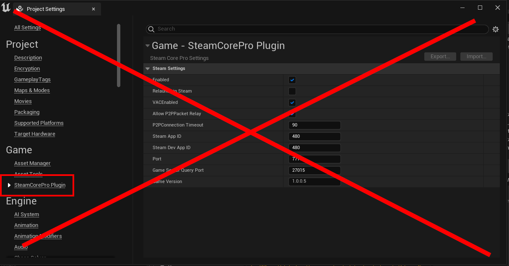

# Configuring the Plugin
:::warning
Project Settings settings have been removed in recent versions of the plugin
:::

:::warning
Project Settings settings have been removed in recent versions of the plugin
:::

## DefaultEngine.ini
- Edit your projects DefaultEngine.ini (located in Project\Config\DefaultEngine.ini)
- To use multiplayer you'll also have to configure [SteamCoreSockets](../multiplayer/configuring_steamsockets.md)

:::note
Make sure that you do not have duplicate entries in your DefaultEngine.ini, **remove any old Steam configurations** that you might have in your config.
:::
## Recommended Settings

```cpp
[OnlineSubsystemSteamCore]
SteamDevAppId=480
SteamAppId=480
bVACEnabled=True
bEnabled=True
bUseSteamNetworking=True
bAllowP2PPacketRelay=True
bRelaunchInSteam=False
P2PConnectionTimeout=90
GameServerQueryPort=27015
GameVersion=1.0.0.0

[OnlineSubsystem]
DefaultPlatformService=SteamCore

[/Script/Engine.GameEngine]
!NetDriverDefinitions=ClearArray
+NetDriverDefinitions=(DefName="GameNetDriver",DriverClassName="SteamCoreSockets.SteamCoreSocketsNetDriver",DriverClassNameFallback="/Script/OnlineSubsystemUtils.IpNetDriver")
```

## Minimal Required Settings
```cpp
[OnlineSubsystemSteamCore]
bEnabled=True
SteamDevAppId=480
SteamAppId=480

[OnlineSubsystem]
DefaultPlatformService=SteamCore
```

## Available Settings
```cpp
/**
* Enable or disable steam
*/

bEnabled=True
```

```cpp
/**
* AppID of your application
*/

SteamAppId=480
SteamDevAppId=480
```

```cpp
/**
* Steam Server Port
*/

Port=7777
```

```cpp
/**
* Copy steamclient dlls when packaging a dedicated server configuration
* Only windows is supported at this time.
*
* Steam Client must be installed on the machine that is packaging.
* This will throw packaging errors if enabled and steam dlls are not found.
*/

bCopySteamDlls=true
```

```cpp
/**
* Enable Steam VAC
*/

bVACEnabled=True
```

```cpp
/**
* Use SteamNetworking
*/
bUseSteamNetworking=True
```

```cpp
/**
* Should Steam P2P sockets all fall back to Steam servers relay if a direct connection fails
* Only usable with the SteamCoreSocketsNetDriver
*
* Listen servers always use this setting regardless of what this is set to
*/

bAllowP2PPacketRelay=True
```

```cpp
/**
* Should the game force a relaunch in Steam if the client isn't already loaded
*/

bRelaunchInSteam=False
```

```cpp
/**
* Timeout (in seconds) period for any P2P session
*/
P2PConnectionTimeout=90
```

```cpp
/**
* Steam Server Query Port
*/
GameServerQueryPort=27015
```

```cpp
/**
* Current game version
*/

GameVersion=1.0.0.0
```

```cpp
/**
* Override console variable: net.MinHandshakeVersion
*/

bOverrideMinHandshakeVersion=True
MinHandshakeVersion=0
```

```cpp
/**
* Override console variable: net.CurrentHandshakeVersion
*/

bOverrideCurrentHandshakeVersion=True
CurrentHandshakeVersion=0
```