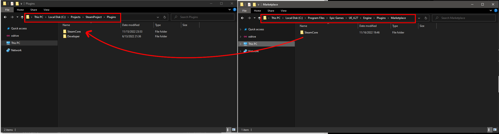
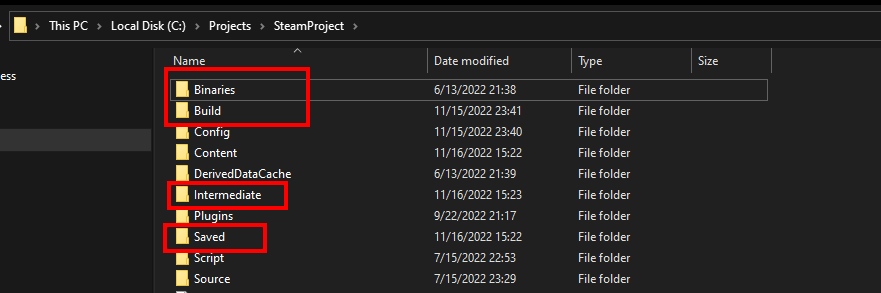

# Installing the Plugin

:::info 📽️ Video Tutorial Available  
You can follow along with our [Getting Started Video Tutorial](../videos/getting_started.mdx) for a visual walkthrough.
:::

## Installation Overview

The plugin can **only** be installed via the **Epic Games Launcher**.

---

## Step 1: Disable Engine Steam Plugins

Before proceeding, make sure to disable any built-in Steam-related plugins that come with the engine.

---

## Step 2: Select Your Engine Version

Open the Epic Launcher and ensure you're selecting the correct version of Unreal Engine.

---

## Step 3: Move the Plugin to Your Project

After installation, **move** (do not copy) the plugin from the engine’s Marketplace directory to your project’s `Plugins` folder.

> If your project doesn't have a `Plugins` directory yet, you’ll need to create one.

**Example Path:**
C:\Program Files\Epic Games\UE_4.27\Engine\Plugins\Marketplace

---

## Step 4: (Optional) Force Plugin/Project Recompile

To ensure everything compiles cleanly, you can force a recompile by deleting the following folders from your **project directory**:

- `Binaries`
- `Build`
- `Intermediate`
- `Saved`

Also delete the following folders from the **SteamCore plugin directory**:

- `Binaries`
- `Intermediate`

---

## Step 5: C++ Project Setup

If you're working with a C++ project, add `SteamCorePro` as a module dependency in your project's `Build.cs` file.

---

## Step 6: Enable the Plugin

Once moved and cleaned, enable the plugin from the Unreal Editor's Plugins menu.

