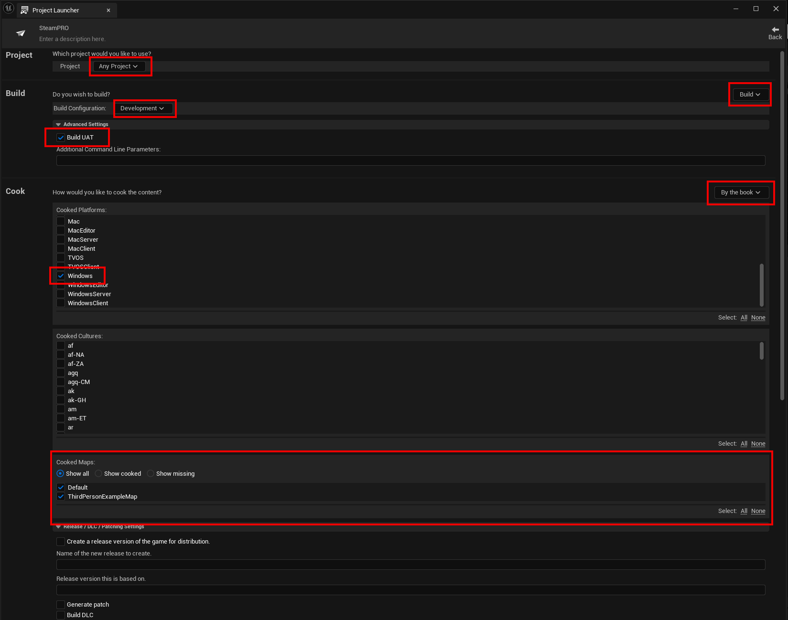

# Building/Packaging your Project 

- Always package your game as a **Development Build** for local testing.
- If packaging as a **Shipping Build**, you must upload the build to Steam and launch it via the Steam Client.

## Packaging Using the Project Launcher

Follow these steps to package your project:

1. **Open the Project Launcher** in Unreal Engine.

   

2. **Configure your profile settings** as needed.

   

3. **Select build configurations** (Development or Shipping).

   

4. **Return using the back button** after configuring the profile.

   

5. **Start packaging by clicking the Launch button**.

   

## Packaging Using the Project Launcher (Unreal Engine 5.6 and later)

Follow these steps to package your project:

1. **Open the Project Launcher** in Unreal Engine.

   

2. Create a new Launch Profile

   

3. Example settings for packaging as a development build

   

4. Click on the "Launch" button to package the selected Profile/Project
   
   
