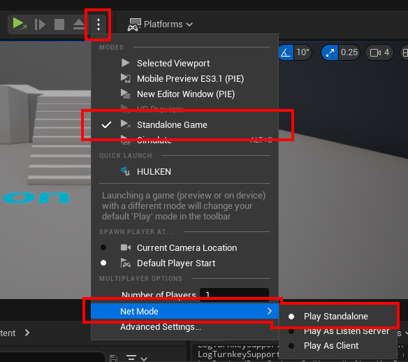

# Testing Steam Functionality

This guide outlines important steps and requirements to ensure smooth testing of Steam integration in your Unreal Engine project.

## Prerequisites for Testing

- Configure Steam settings properly in your `DefaultEngine.ini`. See detailed configuration instructions [here](#).
- Ensure the Steam Client is running and that you are logged in.
- Verify that the Steam account used for testing owns the game. You can:
  - Add the Steam account to your app’s organization, or
  - Obtain Steam keys from Valve to activate the game on the tester’s account.

## Testing a Packaged Build

- Always package your game as a **Development Build** for local testing.
- If packaging as a **Shipping Build**, you must upload the build to Steam and launch it via the Steam Client.

## Packaging Using the Project Launcher
* [Check out this tutorial on how to use the project launcher!](./package-project.md)

## Multiplayer Testing
:::warning NOTE
You must use a Packaged game build to test multiplayer, testing in the editor is not going to work
:::

- Multiplayer testing via Steam requires:
  - Two separate computers, each logged into different Steam accounts, or
  - One computer and a virtual machine (VM) setup.

## Testing in the Editor

To test Steam functionality within the Unreal Editor, launch a **Standalone Game** instance.

### UE4

Launch a standalone instance to initialize Steam.

### UE5

Launch a standalone instance to initialize Steam.

