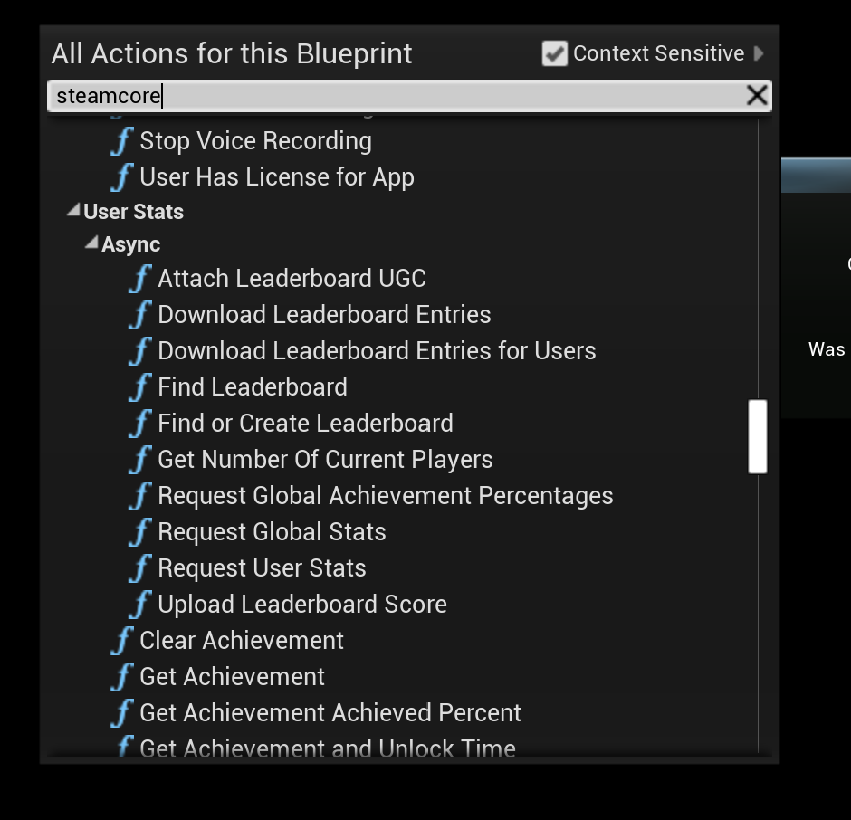
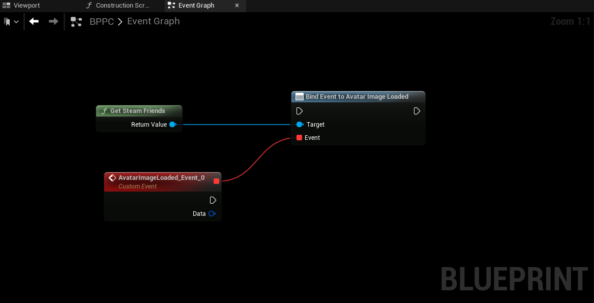
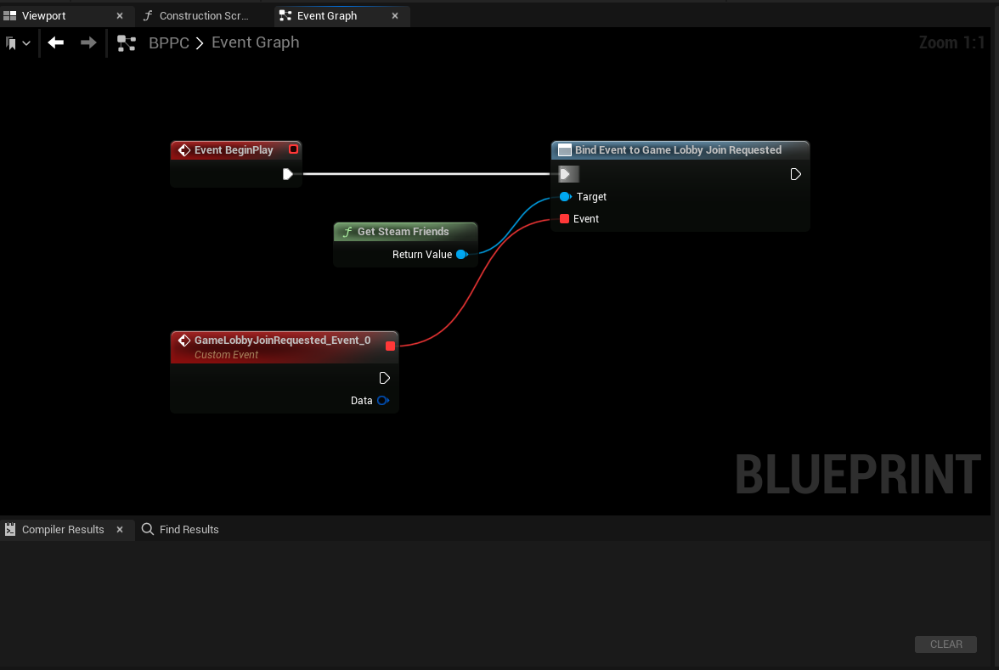

# Using the SteamCore Plugin

This document explains how to use the **SteamCore Plugin**, detailing essential functionality, nodes, async operations, and delegates for streamlined integration.

---

## Testing Steam Functionality

For comprehensive instructions on testing Steam integration, please refer to the [Testing Steam Functionality Documentation](testing_steam_functionality.md).

---

## Accessing SteamCore Nodes

All available **SteamCore** nodes can be found in the Blueprint context menu by simply searching for **SteamCore**.

---

## Using the Steamworks Documentation

The SteamCore Blueprint nodes follow the same naming conventions as the official Steamworks API, providing consistency and ease of use. Instead of direct API calls, you'll work with Blueprint nodes.

- **Official Steamworks Documentation:** [https://partner.steamgames.com/doc/api](https://partner.steamgames.com/doc/api)

Examples of Steamworks nodes:

---

## Async Functions

SteamCore features numerous **Async Functions** designed to execute tasks asynchronously without interrupting gameplay.

:::tip
Always use the **"Callback" execution pin** when working with Async Functions to ensure correct handling.
:::

### Locating Additional Async Functions

To discover more Async functions:

- Navigate to the Blueprint context menu.
- Select **SteamCore → Async**.

---

## Delegates

Steamworks provides numerous delegates that can trigger events in response to Steam client activity. SteamCore simplifies delegate use within Blueprints.

### Assigning Delegates

Using the **Assign** action automatically generates a delegate event with the correct signature.

### Example of Bound Delegates

Delegates bound to Steam events execute automatically when the corresponding event occurs.

For instance, this delegate triggers whenever Steam detects a change in a friend's avatar:

Another example: a delegate triggers when a friend requests to join a lobby through the Steam client:

### Additional Information on Delegates

For a complete overview and further examples, visit the [Steamworks Delegates Documentation](https://partner.steamgames.com/doc/api/ISteamFriends#callbacks).
