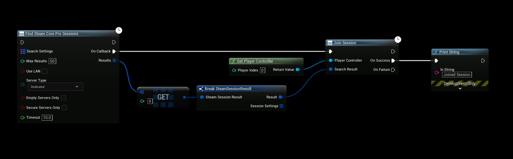
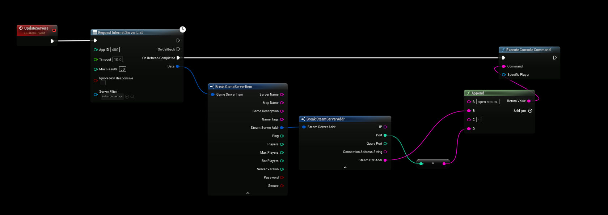
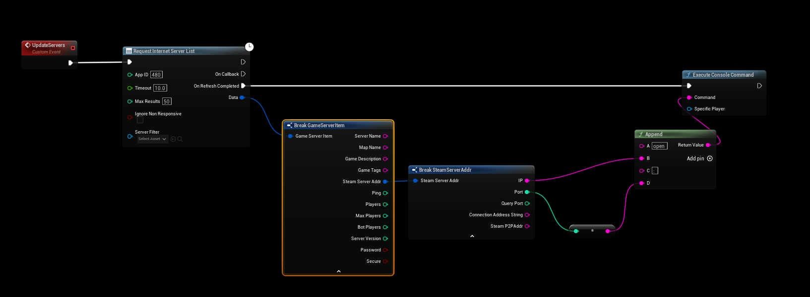

# Connecting to the Server

:::tip TIP
This example includes a video tutorial: [Watch the Video](../../videos/dedicated-server-ue5.mdx)
:::

Depending on your `DefaultEngine.ini` setup, the method for connecting to a dedicated server will vary. Below are three options, all using the **Execute Console Command** node in Unreal Engine.

---

## Option 1: Using Find SteamCore PRO Sessions

- Use this with the **SteamCoreSockets NetDriver**. [See configuration](../../multiplayer/configuring_steamsockets.md)
- Use the **Find SteamCore PRO Sessions** node to locate available multiplayer servers.
- Then connect using the **Join Session** node.

:::caution
This example automatically joins the **first session found** and is intended only for demonstration.  
For production, implement a full server list — see the Blueprint example project.
:::



---

## Option 2: Using SteamCoreSockets (Bypassing Online Subsystem)

- Configuration guide: [SteamCoreSockets NetDriver](../../multiplayer/configuring_steamsockets.md)
- Use this console command:

    ```text
    open steam.P2PAddr:Port
    ```

  Replace **P2PAddr** with your server’s Steam address and **Port** with the appropriate port.

This is a basic demonstration that joins the first found server.
Always implement a proper session browser for real-world use.



## Option 3: Using IpNetDriver (Bypassing Online Subsystem)

- Use this when you're not relying on Steam or any other OnlineSubsystem.
- Configuration guide: [IpNetDriver Setup](../../additional/configuring_ipnetdriver.md)
- Use the following console command:

```text
  open <IP>:<Port>
```

  