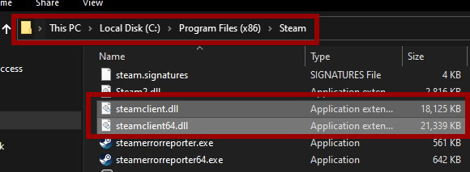
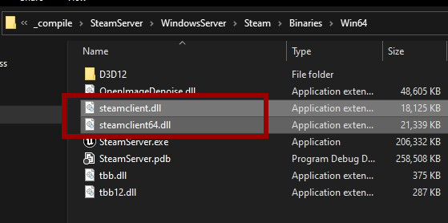

# Initializing

This guide explains how to initialize a dedicated server using **SteamCore** for seamless integration with Steam's online features. For a visual walkthrough, watch the [Video Tutorial](../../videos/dedicated-server-ue5.mdx).

## Prerequisites
- A configured **DefaultEngine.ini** file for your dedicated server.
- **SteamCore PRO** installed and set up in your Unreal Engine project.
- Access to your **Steam App ID** for Steam integration.
- For Steam functionality, ensure the appropriate **steamclient** libraries are correctly placed on the server.

## Initializing with SteamCore Online Subsystem (OSS)
The **SteamCore Online Subsystem (OSS)** simplifies dedicated server initialization. After configuring your server settings in `DefaultEngine.ini`, you can use the **Create SteamCore PRO Session** node to automatically initialize the server.


### Steps
1. Ensure your `DefaultEngine.ini` file is properly configured for the dedicated server.
2. In your server-side logic (e.g., Game Mode or Game Instance Blueprint), add the **Create SteamCore PRO Session** node.
3. Execute the node to initialize the server, which will handle Steam integration automatically.

### Adding Server Attributes
You can include custom attributes (e.g., map name, game mode) to advertise specific server details to players.


#### Steps
1. Add the **Set Session Attributes** node after the **Create SteamCore PRO Session** node.
2. Specify key-value pairs for attributes like `MapName`, `GameMode`, or other custom metadata.
3. These attributes will be visible to players browsing for servers on Steam.

## Enabling Steam Functionality
To use Steam features (e.g., matchmaking, server visibility), you must include the **steamclient** libraries in your server’s directory. Below are instructions for Windows and Linux servers.

### Windows Server
1. **Locate the Steamclient Libraries**:
   - Find the `steamclient.dll` and related files in your Steam SDK or Steam installation directory.

   

2. **Copy the Libraries**:
   - Copy the `steamclient.dll` and associated files to the same directory as your server’s executable (e.g., `YourServer/Binaries/Win64/`).

   

### Linux Server
1. **Locate the steamclient.so File**:
   - Use the `find` command to locate the `steamclient.so` file in your Steam installation or SDK.

   ```bash
   hulken@gameserver:~$ find . -name "*steamclient.so*"
   ./.local/share/Steam/steamcmd/linux32/steamclient.so
   ./.local/share/Steam/steamcmd/linux64/steamclient.so
   ./.steam/sdk64/steamclient.so
   ```

2. **Copy the steamclient.so File**:
   - Copy the appropriate `steamclient.so` file (e.g., 64-bit version) to your server’s executable directory.

   ```bash
   cp /home/hulken/.local/share/Steam/steamcmd/linux64/steamclient.so /home/hulken/LinuxServer/STEAM/Binaries/Linux/
   ```

### Creating steam_appid.txt
In some cases, the server may lack permissions to automatically create the `steam_appid.txt` file. You can create it manually to ensure proper Steam integration.

#### Windows Example
1. Create a file named `steam_appid.txt` in the root directory of your server (e.g., `YourServer/Binaries/Win64/`).
2. Add your **Steam App ID** as the only content in the file.

   

#### Linux Example
1. Create the `steam_appid.txt` file in the server’s executable directory and add your **Steam App ID**.

   ```bash
   hulken@gameserver:~/LinuxServer$ echo "480" > Steam/Binaries/Linux/steam_appid.txt
   ```

## Initializing Without OSS
If you prefer not to use the **SteamCore Online Subsystem**, you can manually initialize the server with Steam functionality. This requires setting up specific nodes to advertise the server on Steam. Refer to the [Steamworks Documentation](https://partner.steamgames.com/doc/api) for a complete list of required nodes.


### Steps
1. Add nodes such as **Initialize Steam Server**, **Set Server Data**, and **Advertise Server** to your server logic.
2. Configure each node with the necessary parameters (e.g., server name, port, Steam App ID).
3. Ensure the `steamclient` libraries and `steam_appid.txt` are correctly set up, as described above.

## Notes
- Always verify that your **Steam App ID** is correct to avoid authentication issues.
- Test server initialization in a development environment to ensure Steam integration works as expected.
- For manual initialization, carefully review the Steamworks API documentation to include all required nodes and settings.
- Ensure the server has appropriate permissions to access the `steamclient` libraries and create or read the `steam_appid.txt` file.