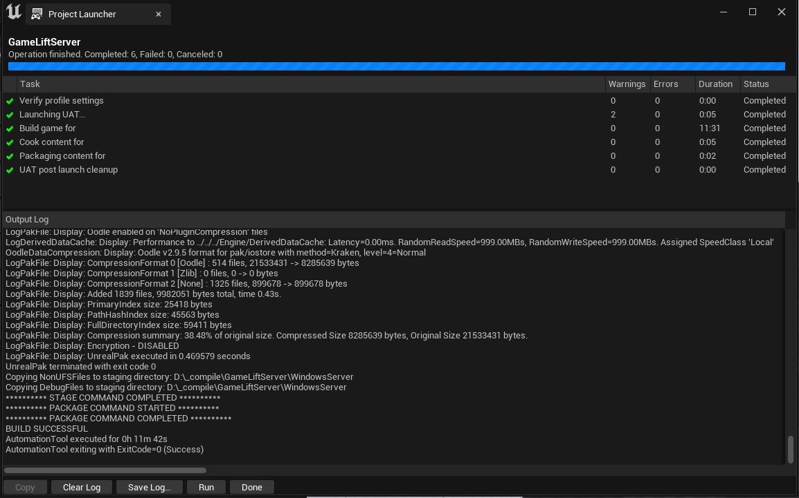
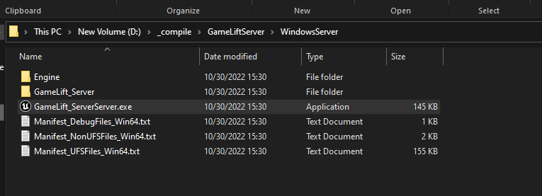
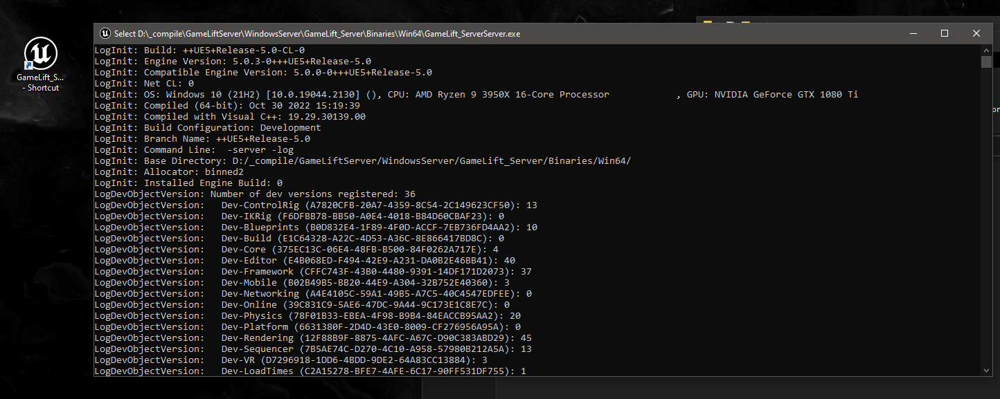

# Launching a Dedicated Server

This guide explains how to package and launch a dedicated server for your Unreal Engine game. You will use Unreal Engine's **Project Launcher** or **Project Packager** to create the server executable, followed by configuring and starting the server with the appropriate parameters.

## Prerequisites
- **SteamCore PRO** plugin installed and enabled in your Unreal Engine project (if using Steam integration).
- A configured `DefaultEngine.ini` file with server settings (refer to [SteamCore Setup Documentation](https://eeldev.com/steamcore)).
- Steamworks integration with a valid **Steam App ID**.
- The project packaged as a dedicated server build.

## Information
- Before launching, you must package your dedicated server application using Unreal Engine's **Project Launcher** or **Project Packager**.
- Once you have the server executable (e.g., `ProjectServer.exe`), you can proceed with the examples below.

## Additional Parameters
- Refer to the [Additional Launch Parameters Guide](../../parameters.md) for optional settings to customize server behavior.

## Packaging the Project
- Follow the official Unreal Engine documentation for packaging your project: [Packaging Documentation](https://docs.unrealengine.com/4.27/en-US/Basics/Projects/Packaging/).



### Steps
1. Open your project in the Unreal Editor.
2. Go to **File** > **Package Project** > **Packaging Settings**.
3. Configure the packaging settings for a dedicated server build (e.g., select "Server" as the build target).
4. Use the **Project Launcher** to create the package, specifying the output directory.

## Launching the Server
After packaging, locate your server executable and set up a shortcut to launch it.

1. **Locate the Executable**:
   - Find your server executable (e.g., `GameLift_ServerServer.exe`) in the packaged output folder. The exact name depends on your project name.

   

2. **Create a Server Shortcut**:
   - Right-click the executable and create a shortcut.
   - Append the `-server` and `-log` parameters to the **Target** field to enable server mode and log output.

   

   **Example Target Path**:
   ```
   D:\_compile\GameLiftServer\WindowsServer\GameLift_ServerServer.exe -server -log
   ```

   - Update the path to match your project’s executable location. The example above is specific to the `GameLiftServer` project.

3. **Start the Server**:
   - Double-click the shortcut to launch the server.
   - The server will start, and log output will be displayed in the console window.

   

## Notes
- **Logging**: The `-log` parameter generates a log file in the `Saved/Logs` directory (e.g., `YourProject.log`) for debugging. Ensure sufficient disk space.
- **Testing**: Test the server launch in a development environment to verify connectivity and log output.
- **Additional Parameters**: Use parameters like `-Port=7777` (see [Additional Launch Parameters](../../parameters.md)) to further configure the server.