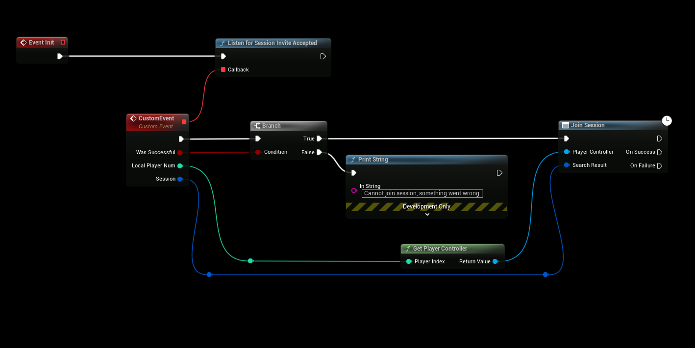
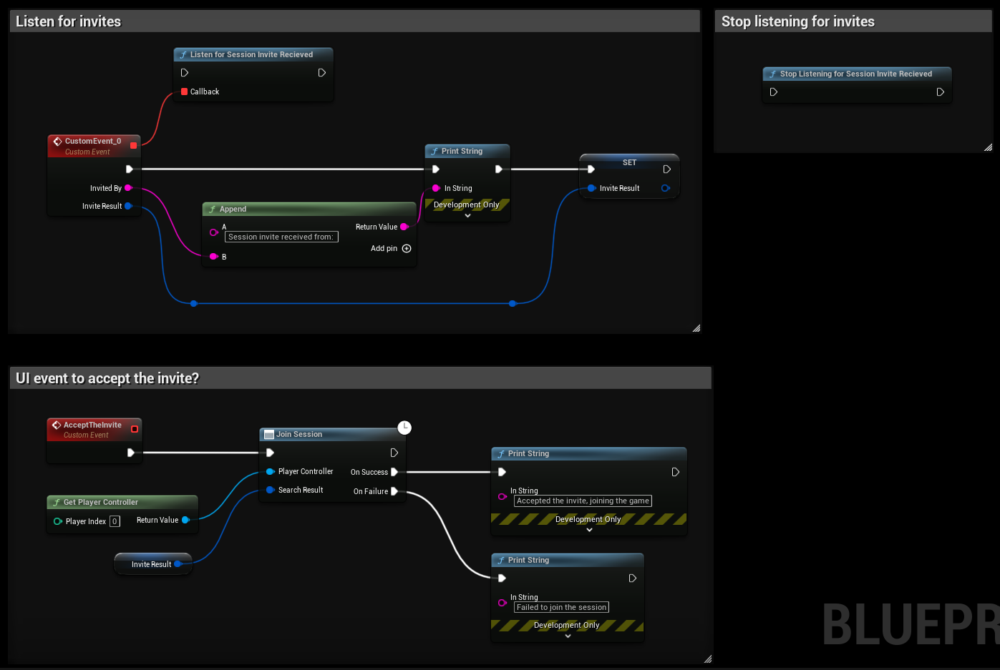

# Inviting Friends to Your Game

This guide explains how to implement friend invitation functionality using **SteamCore PRO** (version **1.0.2.4** or later). For detailed API reference, see the [Steamworks Friends Documentation](https://partner.steamgames.com/doc/api/ISteamFriends#functions).

## Prerequisites
- **SteamCore PRO** version **1.0.2.4** or later.
- A valid Steam session for most invitation features (dedicated servers are not supported for some features).
- Familiarity with retrieving Steam IDs, as some features require a friend's Steam ID. Refer to the [Friends List Guide](../friends/friends_list.md) for details on retrieving Steam IDs.

## Listening for and Accepting Session Invites
To handle session invites (e.g., via the Steam Overlay), use the **Game Instance** to listen for invite events. The following node triggers when a player accepts a game invite through the Steam Overlay or other methods.

### Steps
1. In your **Game Instance**, add the **Listen for Session Invite** node.
2. Connect the event to handle the invite acceptance logic (e.g., joining the session).
3. Ensure the Steam Overlay is enabled for your game to support this feature.

## Stopping Session Invite Listening
To stop listening for session invites, use the following node to disable the event listener.

### Steps
1. Add the **Stop Listening for Session Invite** node in your **Game Instance**.
2. Execute this node when you no longer want to receive session invite events (e.g., when exiting a game mode).

## Listening for Session Invite Notifications (SteamCore PRO 1.0.6.6+)
Starting with **SteamCore PRO 1.0.6.6**, you can listen for session invite notifications directly in-game. This event triggers when a Steam friend sends an invite, allowing you to handle the invitation programmatically (e.g., displaying a UI prompt for the player to accept or decline).

### Key Details
- Supported only for **Steam Sessions** (not dedicated servers).
- Use this node to create custom in-game invite handling, such as showing a pop-up to accept or reject the invite.
- Requires **SteamCore PRO 1.0.6.6** or later.

### Steps
1. In your **Game Instance**, add the **Listen for Invite Received** node.
2. Connect the event to your custom invite-handling logic.
3. Ensure the player has the option to accept or decline the invite via your in-game UI.

## Sending Invites from In-Game
You can send session invites to friends directly from your game without using the Steam Overlay. This requires the friend's **Steam ID**, which can be retrieved using the method described in the [Friends List Guide](../friends/friends_list.md).

### Steps
1. Retrieve the target friend's **Steam ID** using the Friends List API.
2. Add the **Send Session Invite** node in your game logic.
3. Pass the friend's Steam ID to the node to send the invite.
4. Ensure the session is active and supports invites.

## Inviting Friends via Steam Overlay
You can also allow players to send invites using the **Steam Overlay**. When a friend accepts the invite, the **Listen for Session Invite** event (set up in the Game Instance) will trigger.

### Steps
1. Ensure the Steam Overlay is enabled in your game.
2. Players can open the Steam Overlay (default: `Shift + Tab`) and select a friend to invite.
3. The **Listen for Session Invite** event will fire when the invited friend accepts.

## Notes
- Always test invite functionality with valid Steam sessions to ensure compatibility.
- For advanced invite handling, consider combining in-game invites with custom UI notifications for a seamless player experience.
- Ensure your game handles edge cases, such as invalid Steam IDs or disconnected sessions.