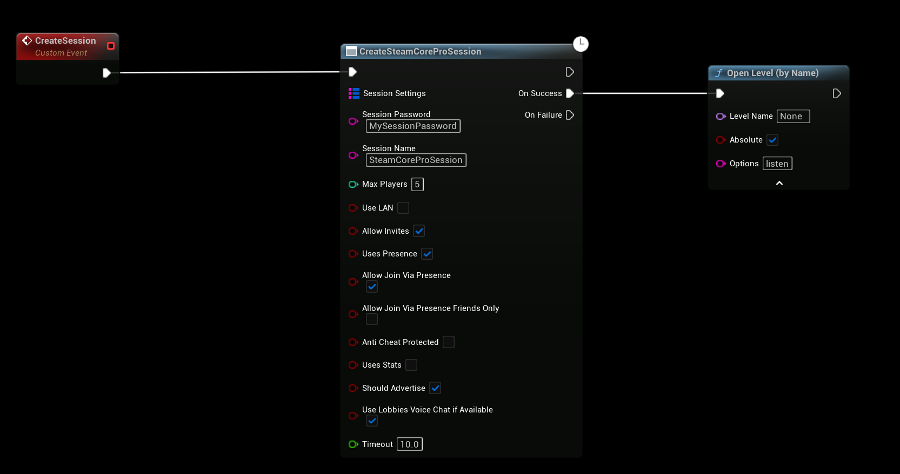
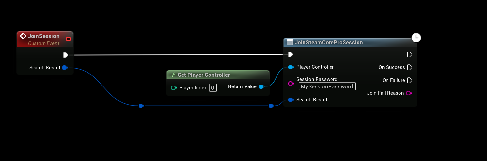

# Passworded Session
* Requires SteamCore PRO 1.0.6.0 and later

# Creating the Session
- The "Create SteamCorePRO Session" node now enables the user to enter a password when creating the session
- The password will be stored in the session settings and is hashed

# Joining the session
- To join a session you will need to use the new "Join SteamCorePRO Session" node, this allows the user to enter a password for the session before joining
- If the password is incorrect or missing, the "Join Fail Reason" will allow you to display the error message letting them know the password was incorrect or missing

