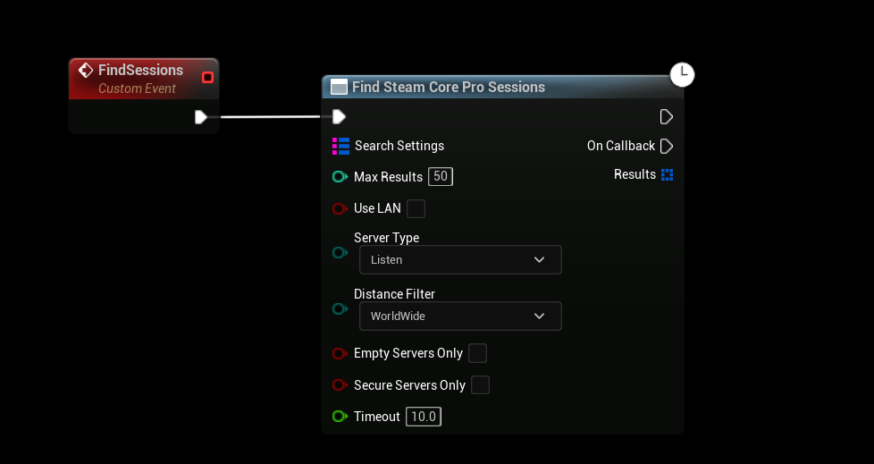
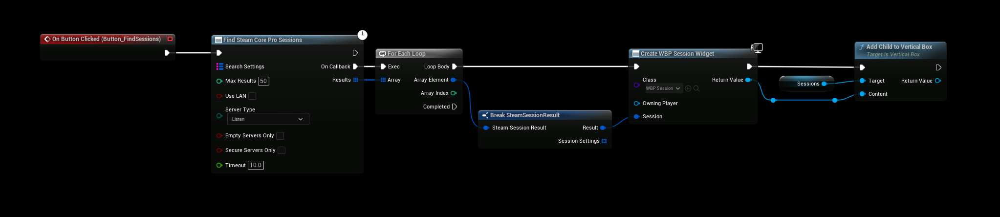
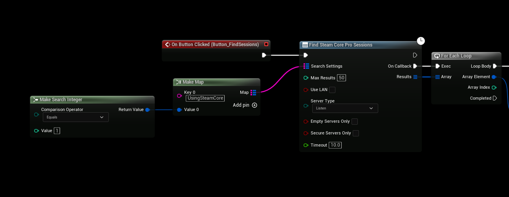

# Finding Sessions

This guide explains how to discover available multiplayer sessions in Unreal Engine using the **SteamCore** plugin. The **Find SteamCore Sessions** node allows you to retrieve a list of active sessions, with the option to apply **Search Settings** filters to refine the results and exclude unwanted sessions.

:::info
A **Video Tutorial** is available to guide you through the process: [Setting Up Steam Multiplayer](../../videos/multiplayer/setting-up-steam-multiplayer.mdx).
:::

## Finding Sessions
To locate multiplayer sessions, use the following approach:

1. **Use the Find SteamCore Sessions Node**:
   - In your game logic (e.g., Game Instance or Menu Blueprint), add the **Find SteamCore Sessions** node.
   - This node queries Steam servers for available sessions and returns a list of sessions that can be joined.

   

2. **Create a Server List UI**:
   - Populate a list of widgets with the found sessions to allow players to select a server to join.
   - For a working example, refer to the Blueprint sample project included with SteamCore, which demonstrates a functional server list UI.

   

### Example Workflow
- Add the **Find SteamCore Sessions** node to your menu Blueprint.
- On success, loop through the returned session list and create widget instances to display server details (e.g., name, player count).
- Connect a **Join Session** node to the player’s selection event to join the chosen server.

## Search Filtering Options
You can refine the session search results using **Search Settings** to filter out unwanted sessions based on custom criteria.

1. **Configure Search Settings**:
   - Add a **Search Settings** structure to the **Find SteamCore Sessions** node.
   - Set filters such as boolean flags, session names, or other metadata defined by your game.

2. **Example Filter**:
   - The example below filters sessions to only include those with the `"UsingSteamCore"` boolean set to `true`.

   

### Steps
- Create a **Search Settings** variable and set the `UsingSteamCore` key to `true`.
- Pass this structure to the **Find SteamCore Sessions** node before executing the search.
- Verify that the returned session list matches your filter criteria.