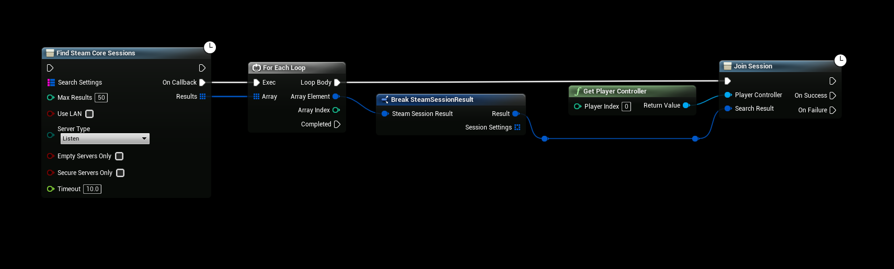

# Joining Sessions

This guide explains how to join a multiplayer game session in Unreal Engine using the **SteamCore** plugin. The **Join Session** node facilitates connecting to an existing session found via the **Find SteamCore Sessions** node, with the Steam Online Subsystem (OSS) handling the connection process.

## Prerequisites
- **SteamCore PRO** plugin installed and enabled in your Unreal Engine project.
- A configured `DefaultEngine.ini` file with SteamCore settings (refer to [SteamCore Setup Documentation](../configuring_steamsockets.md)).
- Steamworks integration with a valid **Steam App ID**.
- An active session created with **Create SteamCore Session** and discovered via **Find SteamCore Sessions** (see [Creating Multiplayer Games](./creating_multiplayer_games.md) and [Finding Multiplayer Games](./finding_multiplayer_games.md)).

:::info
A **Video Tutorial** is available to guide you through the process: [Setting Up Steam Multiplayer](../../videos/multiplayer/setting-up-steam-multiplayer.mdx).
:::

## Joining a Session
Once you have identified a session to join (e.g., from the **Find SteamCore Sessions** node), use the **Join Session** node to establish a connection.

1. **Use the Join Session Node**:
   - In your game logic (e.g., Menu Blueprint or Game Instance), add the **Join Session** node.
   - Pass the session information (e.g., session ID or details from the search results) to the node.
   - The Steam OSS will handle the connection to the target session automatically.

   

### Example Workflow
- After calling **Find SteamCore Sessions**, iterate through the returned session list.
- Select a session (e.g., based on player input from a server list UI).
- Connect the selected session’s details to the **Join Session** node and execute it to join the game.

### Important Note
- The example provided joins the first session found without user selection. This is intended as a demonstration only and should not be used in production.
- For a production environment, implement a server selection UI (e.g., a list of sessions with details like player count or ping) to allow players to choose a session. Refer to the Blueprint sample project for a working example.

