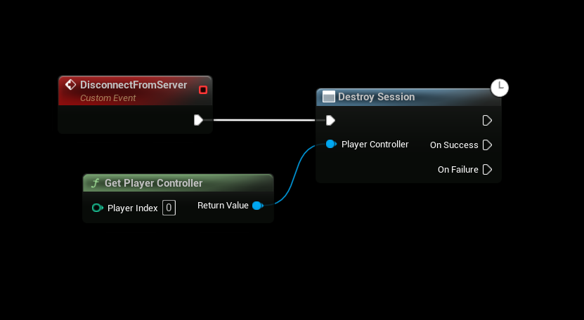

# Leaving a Session or Server

This guide explains how to disconnect a client from a multiplayer session or dedicated server in Unreal Engine using **SteamCore PRO**. The primary method involves using the **Destroy Session** node to cleanly exit a session. This is essential for ensuring proper cleanup of session data and a smooth player experience.

## Using the Destroy Session Node
The **Destroy Session** node is used to disconnect a client from a multiplayer session or server. This node ensures that the session is properly terminated on the client side, freeing up resources and notifying the server.

### Steps
1. **Add the Destroy Session Node**:
   - In your client-side game logic (e.g., Game Instance, Player Controller, or Menu Blueprint), add the **Destroy Session** node.
   - This node is typically executed when the player chooses to leave the session (e.g., via a "Leave Game" button in the UI).

2. **Execute the Node**:
   - Connect the **Destroy Session** node to the appropriate trigger in your game logic (e.g., a UI button press or game event).
   - The node will handle the disconnection process, cleaning up the session data and notifying the server.

3. **Handle Post-Disconnection Logic**:
   - After executing the **Destroy Session** node, redirect the player to a main menu, lobby, or another level as needed.
   - Optionally, display a confirmation message to the player indicating they have left the session.

### Example
The following Blueprint demonstrates how to leave a session using the **Destroy Session** node, triggered by a player action (e.g., clicking a "Leave Game" button).

### Steps in Blueprint
1. Add a trigger event (e.g., a button press in your UI).
2. Connect the event to the **Destroy Session** node.