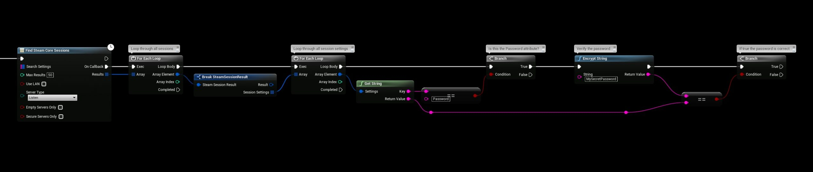

# Password Protected Session

This guide explains how to implement password-protected game sessions or lobbies in Unreal Engine using the **SteamCore** plugin. By leveraging SteamCore’s bonus utilities, you can encrypt passwords and store them as session attributes, ensuring secure access control. Below is an example workflow to set up and verify password protection.

## Creating the Session
To create a password-protected session, follow these steps:

1. **Set the Password**:
   - Use a password, such as `"MySecretPassword"`, for the session.
   - Employ the **Encrypt String** function (a SteamCore utility) to encrypt or hash the password, avoiding storage of plain text for security.

2. **Add Session Attribute**:
   - Add a session attribute of type `String` using the **Set Session Attribute** node.
   - Set the key to `"Password"` and the value to the encrypted string generated by the **Encrypt String** function.

   

### Example Workflow
- In your **Game Instance** or **Game Mode** Blueprint, add the **Create SteamCore Session** node.
- Use the **Encrypt String** node to hash `"MySecretPassword"`.
- Connect the encrypted result to a **Set Session Attribute** node with the key `"Password"`.
- Execute the **Create SteamCore Session** node to establish the protected session.

## Verifying the Password
To check the password when joining a session:

1. **Retrieve Session Attributes**:
   - After calling **Find SteamCore Sessions**, loop through the **Session Settings** array returned in the results to access stored attributes.
   - Extract the `"Password"` attribute to compare with the user’s input.

   

### Important Note
- The provided example is a basic demonstration and not optimized for real-world use. It loops through all sessions to verify passwords, which is inefficient.
- For production, store the **Session Settings** array or password in a server/session browser widget. Verify the password before joining to improve performance and security.

## Storing Session Settings
To manage session data effectively:

1. **Store in a Widget**:
   - Save the **Session Settings** array in a widget that displays the list of servers or sessions, as shown in the example below.

   

### Steps
- Create a widget to display available sessions.
- Store the **Session Settings** array in a variable within the widget when populating the server list.

## Verifying the Password Before Joining
Before joining a session, validate the user’s password input:

1. **Compare Passwords**:
   - Use the **Encrypt String** function to hash the user-entered password.
   - Compare it with the stored `"Password"` attribute from the **Session Settings** using a **String Compare** node.

   

### Example Workflow
- In your server browser widget, add a password input field.
- On the “Join” button click, encrypt the input password and compare it with the stored `"Password"` attribute.
- If they match, trigger the **Join Session** node; otherwise, display an error message.