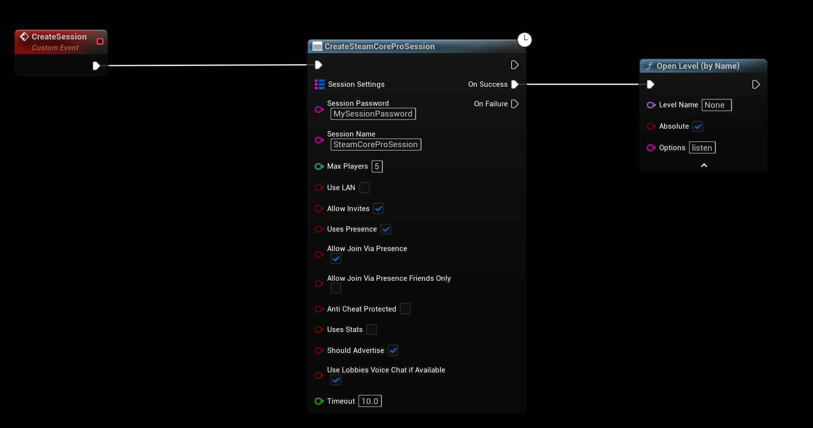

# Creating and Joining Passworded Sessions

This guide explains how to implement password-protected sessions in Unreal Engine using the **SteamCore PRO** plugin (version **1.0.6.0** and later). The plugin introduces enhanced functionality to create and join sessions with password protection, storing passwords securely in session settings and providing feedback for failed join attempts.

## Prerequisites
- **SteamCore PRO** plugin version **1.0.6.0** or later installed and enabled in your Unreal Engine project.

## Creating the Session
The **Create SteamCorePRO Session** node now supports password protection for sessions.

1. **Enter a Password**:
   - When calling the **Create SteamCorePRO Session** node, provide a password (e.g., via a UI input field).
   - The password is hashed and stored securely in the session settings.

   

## Joining the Session
Use the **Join SteamCorePRO Session** node to connect to a password-protected session.

1. **Enter a Password**:
   - Call the **Join SteamCorePRO Session** node and provide the password entered by the user (e.g., via a UI prompt).
   - The node validates the password against the hashed value stored in the session settings.

2. **Handle Join Failures**:
   - If the password is incorrect or missing, the **Join Fail Reason** output provides an error message (e.g., "Incorrect Password" or "Password Required").
   - Use this to display feedback to the player, such as an error notification.

   

## Notes
- **Security**: Passwords are hashed by the **Create SteamCorePRO Session** node, ensuring they are not stored as plain text. Avoid custom encryption for additional security unless necessary.
- **Error Handling**: Implement UI feedback for **Join Fail Reason** outcomes to improve the player experience (e.g., retry prompt for incorrect passwords).
- **Performance**: Ensure password input validation is performed client-side before joining to reduce unnecessary server requests.
- **Compatibility**: This feature requires **SteamCore PRO 1.0.6.0** or later; older versions will not support password-protected sessions.