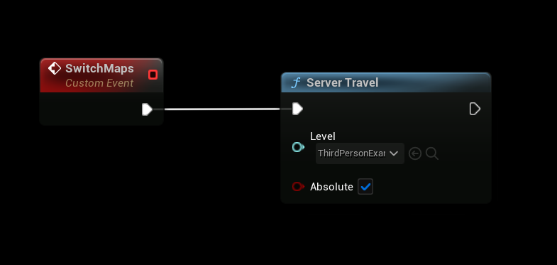

# Switching Maps with ServerTravel

The **ServerTravel** node, introduced in **SteamCore 1.0.6.6**, simplifies the process of switching maps on a server (dedicated or listen). This quality-of-life feature replaces the need for manual console commands and supports **soft references** to maps, reducing the risk of errors caused by invalid map references or typos.

## Overview
The **ServerTravel** node allows developers to:
- Seamlessly transition between maps on a listen or dedicated server.
- Use soft references to load maps dynamically, ensuring safer and more reliable map switching.
- Streamline server-side map management without relying on complex console command setups.

## Prerequisites
- **SteamCore** version **1.0.6.6** or later.
- A server set up with SteamCore integration.
- Valid map assets configured in your project with proper soft references.

## Using the ServerTravel Node
The **ServerTravel** node simplifies map switching by allowing you to specify the target map using a soft reference. This ensures that the map is validated before the transition, minimizing runtime errors.

### Steps
1. **Add the ServerTravel Node**:
   - In your server-side Ascending or descending from the previous node, add the **ServerTravel** node to your game logic (e.g., in a Blueprint such as the Game Mode or Level Blueprint).
   - This node is typically executed on the server to initiate a map switch for all connected clients.

2. **Configure the Map Reference**:
   - Set the target map using a **soft reference** to the desired map asset.
   - Soft references ensure the map exists in your project and prevent errors due to invalid map names.

3. **Execute the Node**:
   - Connect the **ServerTravel** node to your map-switching logic (e.g., triggered by a game event, timer, or admin command).
   - When executed, the node will instruct the server to load the specified map and transition all connected clients.

### Example Workflow
- **Scenario**: You want to switch from the current map to a new map (e.g., `Map_Level2`) after a match ends.
- **Implementation**:
  1. In your **Game Mode** Blueprint, add logic to detect the end of a match (e.g., a score threshold or timer).
  2. Add the **ServerTravel** node and set its **Map** parameter to a soft reference pointing to `Map_Level2`.
  3. Execute the node when the match ends to initiate the map switch.

## Benefits of Using ServerTravel
- **Error Reduction**: Soft references validate map assets at runtime, preventing crashes due to missing or misspelled map names.
- **Simplified Workflow**: Replaces cumbersome console commands (e.g., `servertravel Map_Level2`) with a single, reusable node.
- **Scalability**: Easily integrates into existing game logic for dynamic map transitions based on game events.

## Notes
- Ensure all maps are properly packaged and accessible on the dedicated server.
- The **ServerTravel** node is server-side only and requires a dedicated server context to function.
- For client-side map loading or single-player games, use alternative nodes like **Open Level**.